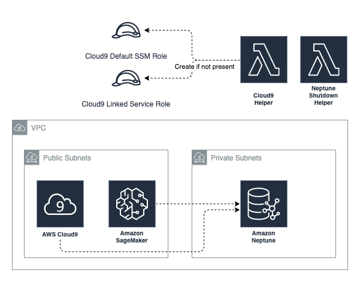

# neptune-quickstart


## Purpose

Playing around with Neptune is scary in your personal account, while cheap enough for a business even a small `db.t3.medium` instance with a `ml.t2.medium` workbench left running for a month can cost you 70 USD if you forget to turn it off.

The CloudFormation stacks here deploys a Cloud9 instance, a Sagemaker instance, and a Neptune cluster all configured to turn themselves off automatically.

## Usage


- [ - eu-north-1](https://console.aws.amazon.com/cloudformation/home?region=eu-north-1#/stacks/new?stackName=neptune-quickstart&templateURL=https://s3.eu-west-1.amazonaws.com/cloudwanderer.io/cloudformation/neptune-quickstart.yaml)
- [ - ap-south-1](https://console.aws.amazon.com/cloudformation/home?region=ap-south-1#/stacks/new?stackName=neptune-quickstart&templateURL=https://s3.eu-west-1.amazonaws.com/cloudwanderer.io/cloudformation/neptune-quickstart.yaml)
- [ - eu-west-3](https://console.aws.amazon.com/cloudformation/home?region=eu-west-3#/stacks/new?stackName=neptune-quickstart&templateURL=https://s3.eu-west-1.amazonaws.com/cloudwanderer.io/cloudformation/neptune-quickstart.yaml)
- [ - eu-west-2](https://console.aws.amazon.com/cloudformation/home?region=eu-west-2#/stacks/new?stackName=neptune-quickstart&templateURL=https://s3.eu-west-1.amazonaws.com/cloudwanderer.io/cloudformation/neptune-quickstart.yaml)
- [ - eu-west-1](https://console.aws.amazon.com/cloudformation/home?region=eu-west-1#/stacks/new?stackName=neptune-quickstart&templateURL=https://s3.eu-west-1.amazonaws.com/cloudwanderer.io/cloudformation/neptune-quickstart.yaml)
- [ - ap-northeast-3](https://console.aws.amazon.com/cloudformation/home?region=ap-northeast-3#/stacks/new?stackName=neptune-quickstart&templateURL=https://s3.eu-west-1.amazonaws.com/cloudwanderer.io/cloudformation/neptune-quickstart.yaml)
- [ - ap-northeast-2](https://console.aws.amazon.com/cloudformation/home?region=ap-northeast-2#/stacks/new?stackName=neptune-quickstart&templateURL=https://s3.eu-west-1.amazonaws.com/cloudwanderer.io/cloudformation/neptune-quickstart.yaml)
- [ - ap-northeast-1](https://console.aws.amazon.com/cloudformation/home?region=ap-northeast-1#/stacks/new?stackName=neptune-quickstart&templateURL=https://s3.eu-west-1.amazonaws.com/cloudwanderer.io/cloudformation/neptune-quickstart.yaml)
- [ - sa-east-1](https://console.aws.amazon.com/cloudformation/home?region=sa-east-1#/stacks/new?stackName=neptune-quickstart&templateURL=https://s3.eu-west-1.amazonaws.com/cloudwanderer.io/cloudformation/neptune-quickstart.yaml)
- [ - ca-central-1](https://console.aws.amazon.com/cloudformation/home?region=ca-central-1#/stacks/new?stackName=neptune-quickstart&templateURL=https://s3.eu-west-1.amazonaws.com/cloudwanderer.io/cloudformation/neptune-quickstart.yaml)
- [ - ap-southeast-1](https://console.aws.amazon.com/cloudformation/home?region=ap-southeast-1#/stacks/new?stackName=neptune-quickstart&templateURL=https://s3.eu-west-1.amazonaws.com/cloudwanderer.io/cloudformation/neptune-quickstart.yaml)
- [ - ap-southeast-2](https://console.aws.amazon.com/cloudformation/home?region=ap-southeast-2#/stacks/new?stackName=neptune-quickstart&templateURL=https://s3.eu-west-1.amazonaws.com/cloudwanderer.io/cloudformation/neptune-quickstart.yaml)
- [ - eu-central-1](https://console.aws.amazon.com/cloudformation/home?region=eu-central-1#/stacks/new?stackName=neptune-quickstart&templateURL=https://s3.eu-west-1.amazonaws.com/cloudwanderer.io/cloudformation/neptune-quickstart.yaml)
- [ - us-east-1](https://console.aws.amazon.com/cloudformation/home?region=us-east-1#/stacks/new?stackName=neptune-quickstart&templateURL=https://s3.eu-west-1.amazonaws.com/cloudwanderer.io/cloudformation/neptune-quickstart.yaml)
- [ - us-east-2](https://console.aws.amazon.com/cloudformation/home?region=us-east-2#/stacks/new?stackName=neptune-quickstart&templateURL=https://s3.eu-west-1.amazonaws.com/cloudwanderer.io/cloudformation/neptune-quickstart.yaml)
- [ - us-west-1](https://console.aws.amazon.com/cloudformation/home?region=us-west-1#/stacks/new?stackName=neptune-quickstart&templateURL=https://s3.eu-west-1.amazonaws.com/cloudwanderer.io/cloudformation/neptune-quickstart.yaml)
- [ - us-west-2](https://console.aws.amazon.com/cloudformation/home?region=us-west-2#/stacks/new?stackName=neptune-quickstart&templateURL=https://s3.eu-west-1.amazonaws.com/cloudwanderer.io/cloudformation/neptune-quickstart.yaml)

## What's deployed

### Cloud9

Cloud9 is an IDE in AWS which is launched in this configuration inside a VPC to allow connectivity to the Neptune instance. 

Cloud9 is the easiest to configure to turn itself off, as it turns itself off by default after 30 minutes of inactivity.

## Sagemaker Notebook

The Sagemaker Notebook in this instance uses the [AWS auto-stop-idle](https://github.com/aws-samples/amazon-sagemaker-notebook-instance-lifecycle-config-samples/tree/master/scripts/auto-stop-idle) script to turn itself off after 30 minutes of inactivity.

## Neptune Cluster

Neptune itself can be stopped for a [maximum of 7 days](https://docs.aws.amazon.com/neptune/latest/userguide/manage-console-stop-start.html) before turning itself on again and provides no native way to automate the process of stopping the instance.

This CloudFormation stack deploys a Lambda function which runs every 3 hours (in lambda [free tier](https://aws.amazon.com/lambda/pricing/)) and turns off the Neptune cluster if it is currently turned on.
## Credits
Adapted from:

- https://github.com/aws-samples/amazon-neptune-samples/tree/master/neptune-workbench-cloudformation
- https://github.com/aws-samples/amazon-neptune-samples/tree/master/neptune-sagemaker/cloudformation-templates/neptune-sagemaker
- https://leehanchung.github.io/2021-06-14-sagemaker-auto-terminate/


## Troubleshooting

## My CloudFormation stack won't delete!

If you get an error like:

```
Db cluster neptunedbcluster-wv5radkmww98 is in stopped state (Service: AmazonNeptune; Status Code: 400; Error Code: InvalidDBClusterStateFault; Request ID: 7da76ecf-8752-45db-aa39-935e74beccbb; Proxy: null)
```

Your CFN Stack won't delete because the Neptune cluster is stopped.  
If you start the cluster again (from the AWS console) and retry the stack deletion once
the status is `Available` then it should delete successfully.
